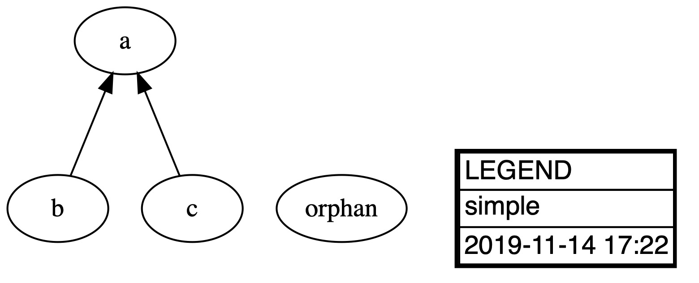
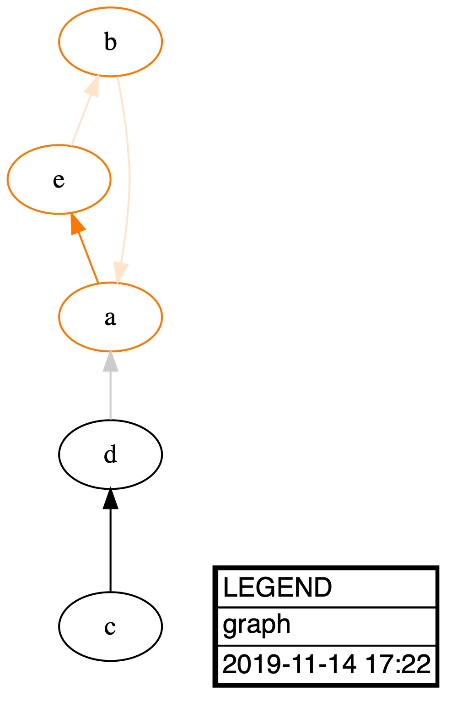
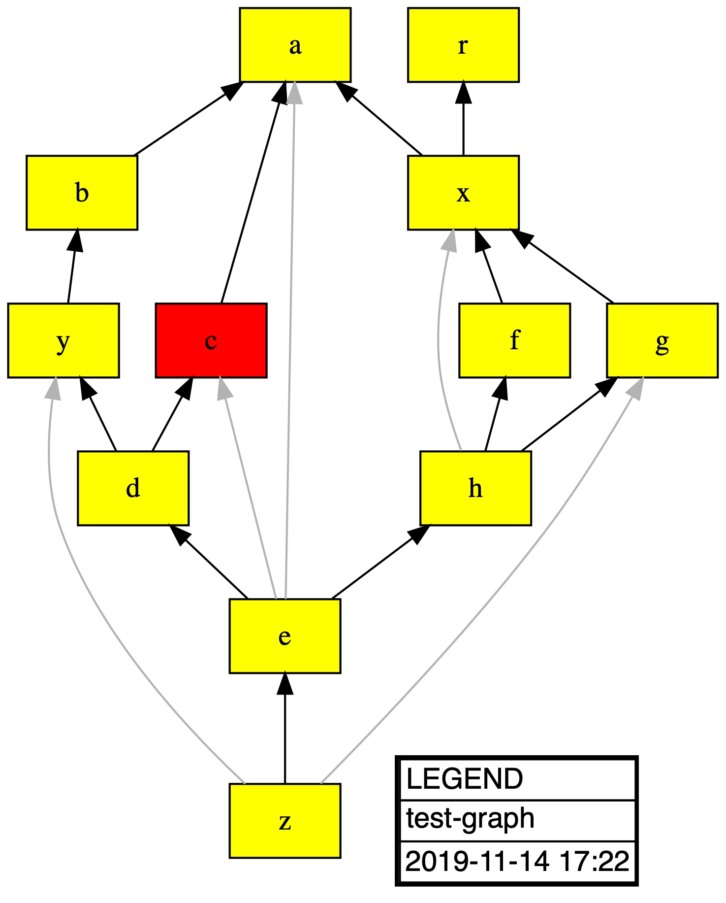
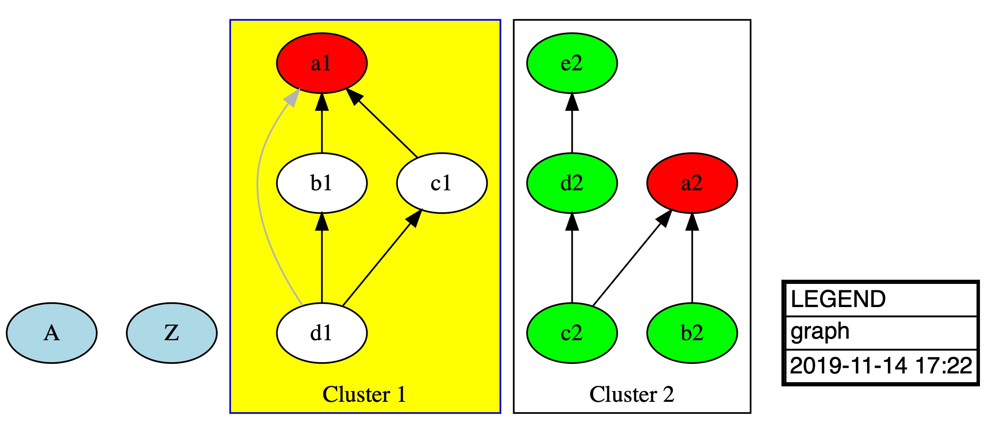
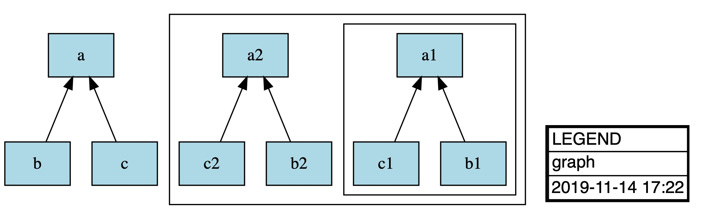
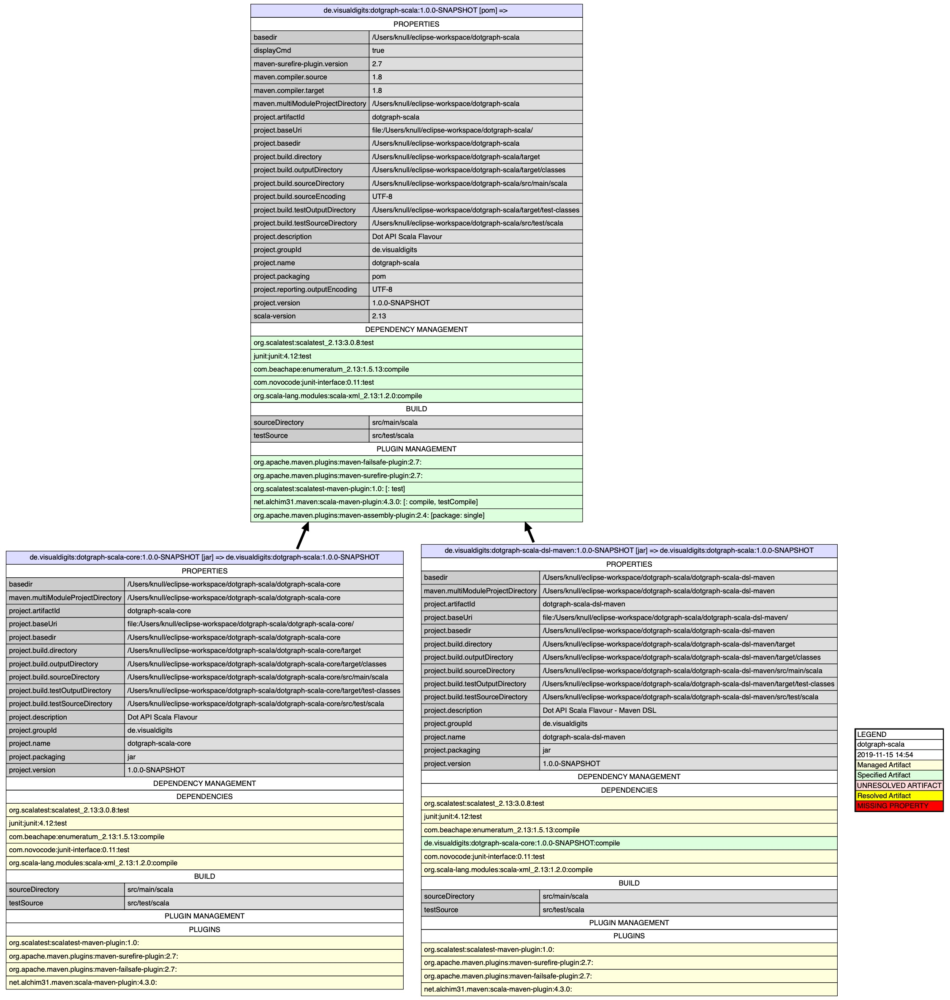

# Dotgraph Scala

## History of the Project
This Project started some years ago as I have been involved in a project to convert a legacy Ant based monolith with checked in
third party libraries into a standard Maven project. As we had to make sure we do not change the original class path
we came up with idea of analyzing dependencies in a graphic manner.
For visualization we chose the dot meta language as described on [this website](https://graphviz.org/).
Over the years many flavours and variants of a Java DSL have been developed but never were published.
Specialized parsers and DSLs for different stuff were created such as Maven, Spring, IntteliJ, Docker, Java and Database (Postgresql).
For my current team at NA News Aktuell I had to learn the Scala language and to go beyond the standard toy like examples I have chosen the
Dotgraph project for porting to Scala as this provides a lot topics which also are part of every day life projects i.e.
generics, inheritance, enumerations, recursion and a lot of patterns to work on.
The result of a month of learning and coding is this repository.

## Structure of the Project
The project is split up in two parts (for now):
* The dotgraph core which represents the DSL to build graphs with a fluent DSL
* The first technical DSL which made sense to implement in the current context: Maven
  With the Maven DSL it is possible to analyze hierarchical Maven projects regarding dependencies, plugins and profiles.
  In this Scala variant the maven scheme is not implemented completely but it should be easy to extend if needed
  
## Usage

### Core DSL

#### Creating a Simple Graph
Here is a simple code snippet which demonstrates the basic usage.
In this example we produce a PDF file with a resolution of 300 DPI.
For supported output formats please have a look into the [dot documentation](https://graphviz.gitlab.io/_pages/doc/info/output.html)

    DotGraph("simple")
      .setDetermineTransitiveEdges(true)
      .addNodeById("a")
      .addNodeById("b")
      .addNodeById("c")
      .addNodeById("orphan")
      .addEdgeById("b", "a")
      .addEdgeById("c", "a")
      .output(dotExecutable, targetDirectory, "simple", "pdf", "300")

#### Cycle Detection
One of the main features of this API is the capability to detect cycles as in this example:
    
    DotGraph("graph")
      .setCycleColors(DotColor("#ff7700"))
      .setFactorTransitive(0.2)
      .setDetermineTransitiveEdges(true)
      .addNodeById("a")
      .addNodeById("b")
      .addNodeById("c")
      .addNodeById("d")
      .addNodeById("e")
      .addEdgeById("c", "d")
      .addEdgeById("b", "a")
      .addEdgeById("d", "a")
      .addEdgeById("a", "e")
      .addEdgeById("e", "b")
      .determineGraphRoutes
      .output(dotExecutable, targetDirectory, "cycle")

#### Calculating Routes and Transitive Edges
Another important feature is the calculation of routes within the graph along with transitive edges.
This feature is shown in a bit more complex graph which also defines a template node with a rectangular shape instead of
the default ellipse:

    DotGraph("test-graph", false, GraphType.digraph)
    graph.setDetermineTransitiveEdges(true)
      .addNode(DotNode(graph)
        .attributes
        .setShape(Shape.rect)
        .setStyle(NodeStyle.filled)
        .setFillcolor(DotColor("yellow"))
        .entity)
      .addNodeById("a")
      .addNodeById("b")
      .addNode(DotNode(graph,"c")
        .attributes
        .setFillcolor(DotColor("red")).entity)
      .addNodeById("d")
      .addNodeById("e")
      .addNodeById("f")
      .addNodeById("g")
      .addNodeById("h")
      .addNodeById("x")
      .addNodeById("y")
      .addNodeById("z")
      .addNodeById("r")
      .addEdgeById("b", "a")
      .addEdgeById("c", "a")
      .addEdgeById("d", "c")
      .addEdgeById("e", "c")
      .addEdgeById("e", "a")
      .addEdgeById("e", "d")
      .addEdgeById("x", "a")
      .addEdgeById("y", "b")
      .addEdgeById("z", "e")
      .addEdgeById("z", "g")
      .addEdgeById("x", "r")
      .addEdgeById("d", "y")
      .addEdgeById("f", "x")
      .addEdgeById("g", "x")
      .addEdgeById("h", "f")
      .addEdgeById("h", "x")
      .addEdgeById("h", "g")
      .addEdgeById("e", "h")
      .addEdgeById("z", "y")
      .determineGraphRoutes
      .output(dotExecutable, targetDirectory, "routes")

#### Sub Graphs
Graphs may also be nested which is demonstrated by the following code snippet.
Please note that sub graphs must have an id which starts with the word 'cluster'
this is a restriction of the dot language.

    val cluster1 = DotGraph("cluster1", graphType = GraphType.subgraph)
    cluster1.setCreateLegend(CreateLegend.NONE)
      .setDetermineTransitiveEdges(true)
      .attributes
      .setLabel("Cluster 1")
      .setStyle(ClusterStyle.dotted)
      .setColor(DotColor("blue"))
      .setStyle(ClusterStyle.filled)
      .setFillcolor(DotColor("yellow"))
      .entity
      .addNode(DotNode(cluster1)
        .attributes
        .setStyle(NodeStyle.filled)
        .setFillcolor(DotColor("white"))
        .entity)
      .addNode(DotNode(cluster1, "a1")
        .attributes
        .setStyle(NodeStyle.filled)
        .setFillcolor(DotColor("red"))
        .entity)
      .addNodeById("b1")
      .addNodeById("c1")
      .addNodeById("d1")
      .addEdgeById("b1", "a1")
      .addEdgeById("c1", "a1")
      .addEdgeById("d1", "b1")
      .addEdgeById("d1", "c1")
      .addEdgeById("d1", "a1")

    val cluster2 = DotGraph("cluster2", graphType = GraphType.subgraph)
    cluster2.setCreateLegend(CreateLegend.NONE)
      .setDetermineTransitiveEdges(true)
      .attributes
      .setLabel("Cluster 2")
      .entity
      .addNode(DotNode(cluster2)
        .attributes
        .setStyle(NodeStyle.filled)
        .setFillcolor(DotColor("green"))
        .entity).addNode(DotNode(cluster2, "a2")
      .attributes
      .setStyle(NodeStyle.filled)
      .setFillcolor(DotColor("red"))
      .entity)
      .addNodeById("b2")
      .addNodeById("c2")
      .addNodeById("d2")
      .addNodeById("e2")
      .addEdgeById("b2", "a2")
      .addEdgeById("c2", "a2")
      .addEdgeById("c2", "d2")
      .addEdgeById("d2", "e2")

    val graph = DotGraph("graph")
    graph.setDetermineTransitiveEdges(true)
      .addNode(DotNode(graph)
        .attributes
        .setStyle(NodeStyle.filled)
        .setFillcolor(DotColor("lightblue"))
        .entity)
      .addNodeById("A")
      .addGraph(cluster1)
      .addGraph(cluster2)
      .addNodeById("Z")
      .addEdgeById("Z", "c2")
      .addEdgeById("Z", "d1")
      .addEdgeById("a1", "A")
      .addEdgeById("e2", "A")
      .determineGraphRoutes
      .output(dotExecutable, targetDirectory, "subgraph")

#### Nested Graphs
It is also possible to nest graphs. Here the same rules for sub graphs apply regarding their naming as mentioned in the
previous section.

    val cluster1 = DotGraph("cluster1", graphType = GraphType.subgraph)
      .setCreateLegend(CreateLegend.NONE)
      .setDetermineTransitiveEdges(true)
      .addNodeById("a1")
      .addNodeById("b1")
      .addNodeById("c1")
      .addEdgeById("b1", "a1")
      .addEdgeById("c1", "a1")

    val cluster2 = DotGraph("cluster2", graphType = GraphType.subgraph)
      .setCreateLegend(CreateLegend.NONE)
      .setDetermineTransitiveEdges(true)
      .addNodeById("a2")
      .addNodeById("b2")
      .addNodeById("c2")
      .addEdgeById("b2", "a2")
      .addEdgeById("c2", "a2")
      .addGraph(cluster1)

    val graph = DotGraph("graph")
    graph.setDetermineTransitiveEdges(true)
      .addNode(DotNode(graph)
        .attributes.setShape(Shape.rect)
        .setStyle(NodeStyle.filled)
        .setFillcolor(DotColor("lightblue"))
        .entity)
      .addNodeById("a")
      .addNodeById("b")
      .addNodeById("c")
      .addEdgeById("b", "a")
      .addEdgeById("c", "a")
      .addGraph(cluster2)
      .output(dotExecutable, targetDirectory, "nested")

### Maven DSL
Creating a fact sheet for a given Maven project is easy as:

    PomGraph(new File("../pom.xml")).output(targetDirectory, format = "jpg", dpi = "300")

In this case we will produce a JPG image file with a resolution of 300 DPI.
The fact sheet will contain information about

* Dependency Management
* Dependencies
* Plugin Management
* Plugins
* Profile Executions

All topics above will be derived from top to bottom according to the modules structure of the project where
all placeholders are resolved from properties (some of the most important standard Maven properties are also calculated).
Here is the list of supported predefined Maven properties:

Project coordinates:
* project.packaging - The packaging of the project
* project.artifactId - The artifactId of the projects artifact
* project.groupId - The groupId of the projects artifact
* project.version - The version of the projects artifact
* project.name - The name of the projects artifact
* project.description - The description of the projects artifact

Directories:
* basedir - The directory where the pom.xml is stored
* project.basedir - The directory where the pom.xml is stored
* project.baseUri - The directory where the pom.xml is stored as URI
* maven.multiModuleProjectDirectory - The directory where the top pom.xml is stored
* project.build.directory - The 
* project.build.sourceDirectory
* project.build.outputDirectory
* project.build.testSourceDirectory
* project.build.testOutputDirectory

For this project the sheet looks as follows: 
    
